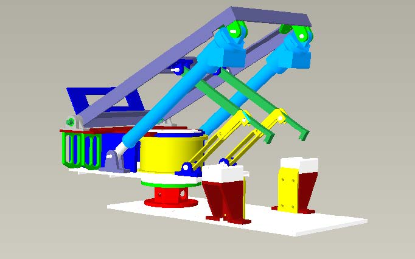

# Robot

山东大学2019级数据科学与人工智能实验班《嵌入式机器人开发（Ⅰ）》课程作业

使用Creo7.0.3.0完成车载底座零件绘制，装配，仿真

- 零件与装配(creo)：

  ​		本文件是creo画完后的原文件

- 零件与装配(.stp)：

  ​		本文件是通过导出的.stp文件

- video.avi：

  ​		运动仿真的动画文件，实现了方位360°连续旋转，俯仰0到70°旋转
  
  链接：https://pan.baidu.com/s/1deqJyAC0qGhd6VMD_TIzRA 
  提取码：k5g0

效果图:

